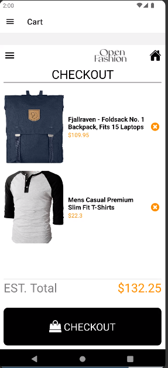

# rn-assignment7-11137631
# 11137631
# Shopping application

This project is a simple React Native application that allows users to browse products, view product details, and manage a shopping cart. The application is designed with a clean and user-friendly interface, providing essential e-commerce functionalities.

## Table of Contents
- [Features](#features)
- [Design Choices](#design-choices)
- [Data Storage](#data-storage)
- [Screenshots](#screenshots)
- [Installation](#installation)
- [Usage](#usage)

## Features
- **Home Screen**: Displays a list of products fetched from a fake API.
- **Product Detail Screen**: Shows detailed information about a selected product.
- **Cart Screen**: Allows users to view, add, and remove items from their shopping cart.
- **Drawer Navigation**: Provides easy navigation through different screens.

## Design Choices
1. **Navigation**: Implemented using React Navigation with a combination of Drawer and Stack navigators to allow for easy and intuitive navigation between screens.
2. **UI Components**: Used React Native components for a consistent look and feel across different devices.
3. **State Management**: Managed component state using React hooks (useState, useEffect) to keep the application simple and efficient.

## Data Storage
- **Fake API**: Product data is simulated using a local array of objects, mimicking a real API. This approach was chosen for simplicity and ease of testing.
- **Local State**: Cart data is managed using React's useState hook. In a real application, this could be replaced with more sophisticated state management solutions like Redux or Context API.

## Screenshots

### Home Screen


### Drawer Screen


### Product Detail Screen


### Cart Screen




## Installation
1. Clone the repository:
   ```bash
   git clone https://github.com/your-username/product-detail-cart-app.git
